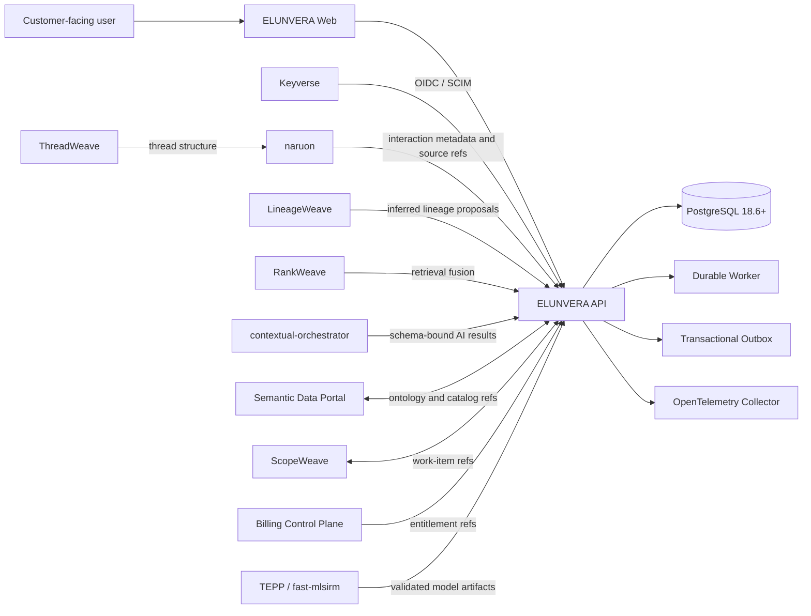
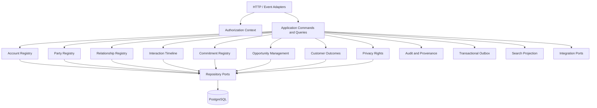
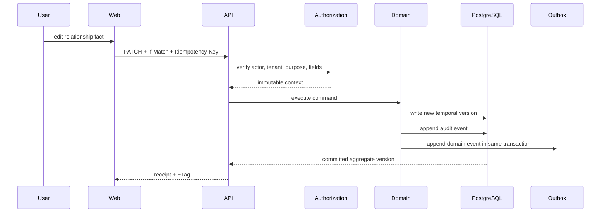
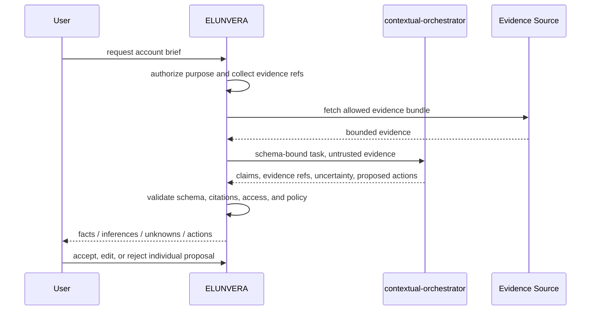

# ELUNVERA Architecture

## 1. Architecture purpose

This document defines ELUNVERA’s durable responsibility boundaries and deployable shape. It prevents a CRM repository from absorbing email hosting, project management, billing, identity, ontology, or scientific-compute responsibilities that already belong elsewhere in the CWL ecosystem.

## 2. Context diagram



## 3. Source-of-truth matrix

| Fact | Authority |
|---|---|
| Commercial account, customer/prospect/partner role history | ELUNVERA |
| Contact and organization relationship facts inside a tenant | ELUNVERA |
| Opportunity, stage, stakeholder, value, forecast snapshot | ELUNVERA |
| Customer commitment, complaint, outcome, satisfaction reference | ELUNVERA |
| User authentication, federation, SCIM identity | Keyverse |
| Raw mailbox, calendar, and file content | Customer provider / naruon control plane |
| RFC message thread computation | ThreadWeave |
| Generalized project and work execution | ScopeWeave |
| Invoice, subscription, payment, entitlement commercial truth | Billing Control Plane |
| Enterprise ontology and catalog | Semantic Data Portal |
| Inferred lineage proposal | LineageWeave |
| Model routing and LLM workflow trace | contextual-orchestrator |
| Psychometric and temporal analysis artifact | Psychometrics Commons, fast-mlsirm, or TEPP as applicable |
| Employee and employment truth | Orgmetra |

## 4. Recommended approach

### Approach A — Full-suite CRM monolith

Place mail, calendar, tasks, marketing, billing, support, AI, and analytics in ELUNVERA.

**Rejected:** duplicates established CWL products, creates excessive privileges, and makes customer data migration and release independence difficult.

### Approach B — Graph-only intelligence overlay

Leave all customer and opportunity truth in external CRMs and provide only an intelligence graph.

**Rejected as the primary product:** useful as an integration mode, but it cannot guarantee authoritative relationship history, purpose policy, or reversible data stewardship.

### Approach C — Federated CRM system of record with evidence and intelligence

ELUNVERA owns the narrow commercial relationship and opportunity domain, while integrating with independent CWL systems through versioned ports.

**Accepted:** preserves authority, modularity, auditability, and an incremental commercial path.

## 5. Runtime topology

### Initial deployment

```text
reverse proxy / gateway
        |
        +-- elunvera_web
        +-- elunvera_api
        +-- elunvera_worker
        +-- PostgreSQL
        +-- object storage adapter
        +-- OpenTelemetry collector
```

The API and worker may share one Rust workspace and deploy separately from the same versioned artifact. A dedicated message broker is optional at first; the transactional outbox and bounded polling worker provide durability without requiring a distributed control plane.

### Extraction criteria

A module may become an independent service only when at least one is demonstrated:

- independent data authority;
- independent regulatory or security zone;
- materially different availability or scaling requirement;
- independent release ownership;
- workload isolation that cannot be achieved safely in-process;
- reuse by multiple products through a stable public contract.

## 6. Internal component diagram



## 7. Command flow



## 8. AI proposal flow



No AI output changes canonical state before the final user or approved policy action.

## 9. Trust zones

| Zone | Assets | Default trust |
|---|---|---|
| Browser | UI state, user input, rendered account data | Untrusted client |
| Public edge | HTTP headers, webhook payloads, uploaded files | Hostile input |
| Application | authorization context, domain commands | Trusted only after verification |
| Data store | canonical facts, audit, keys by reference | Restricted |
| Connector | provider tokens and external payloads | High-risk boundary |
| Model plane | prompts, evidence bundles, model output | Untrusted output and data processor |
| Observability | metrics, traces, logs | No raw customer content |
| Build/release | source, dependencies, artifacts, attestations | Supply-chain boundary |

## 10. Data flows

### Interaction observation

```text
customer-owned source
→ naruon or approved connector
→ normalized interaction metadata
→ ELUNVERA source receipt
→ interaction projection
→ relationship / commitment proposal
→ human review
```

### Opportunity update

```text
verified actor
→ opportunity command
→ optimistic concurrency
→ append stage/value/forecast fact
→ audit + outbox
→ read-model projection
```

### Data-rights export

```text
verified request
→ identity and scope resolution
→ source inventory
→ purpose and legal-hold policy
→ asynchronous export
→ manifest + hashes + omissions/reasons
→ authorized download
→ expiry + audit receipt
```

## 11. Failure posture

- Identity key unavailable: authenticated routes fail closed; liveness remains healthy and readiness fails.
- Database schema incompatible: startup fails closed.
- Outbox transport unavailable: canonical writes may continue only while bounded backlog and storage SLO remain safe; event lag alerts fire.
- AI provider unavailable: core CRM remains available; proposal workflow reports retryable unavailability.
- Search projection stale: exact canonical lookup remains available and UI labels search freshness.
- Connector failure: preserve last successful cursor and receipt; never mark incomplete sync as current.
- Authorization ambiguity: deny and record policy reason without leaking object existence.

## 12. Deployment portability

A Compose profile is the reference developer and single-node enterprise deployment. Services use health contracts and externalized configuration compatible with future Kubernetes deployment. Container project names remain stable outside isolated tests. GPU services, when introduced for model workloads, remain separately schedulable and are not required for the transactional CRM core.

## 13. Architecture conformance

The architecture is conformant when:

- each canonical fact has exactly one declared authority;
- no integration uses direct cross-repository SQL;
- every projection can be rebuilt from authoritative records and receipts;
- all writes pass verified tenant and purpose context;
- model output is distinguishable from authoritative fact;
- every event has provenance and idempotent consumption;
- no user-facing workflow depends synchronously on an LLM;
- runtime and docs agree on implemented capabilities.
