# ELUNVERA Data Model

## 1. Modeling goals

The canonical model must preserve:

- commercial account identity without equating an account to an organization forever;
- people, organizations, groups, and contact points without using mutable identifiers as primary keys;
- multiple simultaneous and time-varying roles;
- first-class relationships with evidence and disclosure policy;
- immutable stage, value, forecast, complaint, and commitment history;
- tenant isolation, bitemporal facts, provenance, and item-level idempotency;
- exact money and auditable model artifacts.

## 2. Naming convention

- Tables, columns, indexes, constraints, functions, and schemas use `snake_case`.
- Database object names contain at least two words.
- Primary keys use `<object>_id` with UUIDv7 values.
- Foreign keys preserve the referenced object name.
- Boolean names express the affirmative condition.
- Timestamps use `_at`; business-valid ranges use `_valid_time`; system ranges use `_recorded_time`.
- Generic names such as `data`, `item`, `object`, `user`, `customer`, and `buyer` are not used without a bounded domain qualifier.

## 3. Core ERD

```mermaid
erDiagram
    tenant_account ||--o{ workspace_record : contains
    tenant_account ||--o{ party_record : owns
    tenant_account ||--o{ commercial_account : owns
    party_record ||--|| person_party : specializes
    party_record ||--|| organization_party : specializes
    party_record ||--|| group_party : specializes

    commercial_account }o--|| party_record : centers_on
    commercial_account ||--o{ account_role_assignment : has
    commercial_account ||--o{ account_team_assignment : staffed_by
    workspace_member ||--o{ account_team_assignment : serves

    party_record ||--o{ contact_point_record : has
    party_record ||--o{ relationship_participant : participates
    relationship_record ||--o{ relationship_participant : contains
    relationship_record ||--o{ evidence_reference : supported_by

    commercial_account ||--o{ interaction_record : contextualizes
    interaction_record ||--o{ interaction_participant : includes
    interaction_record ||--o{ commitment_record : yields
    interaction_record ||--o{ evidence_reference : cites

    commercial_account ||--o{ opportunity_record : has
    sales_process_version ||--o{ sales_stage_definition : defines
    opportunity_record ||--o{ opportunity_stage_transition : changes
    opportunity_record ||--o{ opportunity_party_role : includes
    opportunity_record ||--o{ opportunity_value_snapshot : values
    opportunity_record ||--o{ forecast_snapshot : forecasts

    commercial_account ||--o{ customer_outcome_record : seeks
    commercial_account ||--o{ complaint_record : reports
    commercial_account ||--o{ satisfaction_observation : measures
    commercial_account ||--o{ relationship_assessment : assesses

    model_artifact ||--o{ forecast_snapshot : produces
    model_artifact ||--o{ relationship_assessment : produces
    source_receipt ||--o{ evidence_reference : anchors
    audit_event ||--o{ outbox_event : accompanies
```



## 4. Identity and tenancy

### `tenant_account`

Represents the customer isolation boundary. It is not a billing account; billing is referenced from the Billing Control Plane.

Required fields:

```text
tenant_account_id
tenant_slug
lifecycle_status_code
default_locale_code
created_at
updated_at
```

### `workspace_record`

A bounded operating space inside a tenant. A tenant may separate regions, business units, or sales processes without creating a separate security tenant.

### `workspace_member`

References a verified Keyverse subject. It may optionally reference an Orgmetra worker record, but ELUNVERA does not copy employment truth.

## 5. Party model

### `party_record`

Canonical tenant-local identity for a person, organization, or group.

```text
party_record_id
tenant_account_id
party_kind_code
canonical_display_name
lifecycle_status_code
created_at
updated_at
```

The `party_kind_code` is structural (`person`, `organization`, `group`), not a commercial role such as customer or partner.

### Type extensions

- `person_party`
- `organization_party`
- `group_party`

Each extension uses the same `party_record_id` as primary and foreign key.

### `party_name_record`

Stores legal, preferred, localized, historical, and source-observed names with valid intervals and scripts/locales.

### `contact_point_record`

Stores email, phone, postal, URI, or other contact points with:

- verification status;
- source;
- purpose compatibility;
- valid interval;
- confidentiality classification;
- preferred-use flag within a defined purpose.

An email address is not a person identity.

### `external_object_mapping`

```text
external_object_mapping_id
tenant_account_id
source_authority_code
external_object_type_code
external_object_key
internal_object_type_code
internal_object_id
mapping_valid_time
mapping_status_code
source_receipt_id
```

A unique constraint on tenant, source authority, object type, and external key prevents duplicate ingestion.

## 6. Commercial account model

### `commercial_account`

Represents a tenant’s managed commercial relationship centered on a party or defined group of parties.

It is distinct from `organization_party`. One organization may have multiple commercial accounts by region, contract scope, business unit, or lifecycle, and one account may involve multiple organizations.

### `account_party_binding`

Links parties to a commercial account and records the binding role and valid interval.

### `account_role_assignment`

Stores time-valid roles such as prospect, active customer, former customer, implementation partner, reseller, strategic partner, or supplier. Role types are versioned tenant configuration, not hard-coded identity types.

### `account_team_assignment`

Links workspace members to an account with role, authority, valid interval, source, and optional Orgmetra assignment reference.

## 7. Relationship model

### `relationship_record`

A relationship is a fact with its own identity.

Required fields:

```text
relationship_record_id
tenant_account_id
relationship_type_id
relationship_context_type_code
relationship_context_id
truth_status_code
relationship_valid_time
relationship_recorded_time
source_authority_code
confidence_value
confidence_method_code
disclosure_policy_id
created_by_actor_ref
```

Rules:

- `confidence_value` is required for inferred facts and absent for authoritative facts unless an explicit measurement applies.
- Confidence is not permission to disclose.
- A relationship may have more than two participants.
- The same participants may have multiple relations in different contexts.
- A rejected proposal remains historically visible to authorized reviewers.

### `relationship_participant`

```text
relationship_participant_id
relationship_record_id
party_record_id
participant_role_code
participant_order
```

### `relationship_type_version`

Versioned vocabulary including directionality, allowed participant roles, symmetry, transitivity, context types, and validation rules.

A transitive type must not imply global authority across unrelated contexts.

## 8. Evidence and source model

### `source_receipt`

Immutable receipt for a source object, import, connector observation, manual assertion, or model run.

```text
source_receipt_id
tenant_account_id
source_authority_code
source_object_key
source_hash_sha256
captured_at
knowledge_cutoff
collector_version
classification_code
raw_artifact_reference
```

### `evidence_reference`

Connects a domain fact to a bounded source locator without copying all source content.

```text
evidence_reference_id
source_receipt_id
subject_type_code
subject_id
source_locator
assertion_role_code
excerpt_hash_sha256
review_status_code
```

## 9. Interaction and commitment model

### `interaction_record`

```text
interaction_record_id
tenant_account_id
commercial_account_id
interaction_type_code
occurred_time
recorded_at
source_authority_code
source_receipt_id
confidentiality_code
summary_status_code
```

Raw email or calendar bodies are not mandatory. Metadata and source references can create a useful timeline without copying content.

### `interaction_participant`

Links parties and workspace members to the interaction with role and attendance/status metadata.

### `commitment_record`

```text
commitment_record_id
tenant_account_id
commercial_account_id
commitment_subject
commitment_status_code
commitment_valid_time
due_time
owner_party_id
beneficiary_party_id
source_interaction_id
truth_status_code
```

### `commitment_transition`

Append-only status transition with actor, business time, recorded time, reason, evidence, and external work reference.

## 10. Opportunity model

### `sales_process_version`

An immutable released sales process. New definitions produce new versions.

### `sales_stage_definition`

Defines stage code, display order, entry/exit evidence policy, and allowed transitions. It does not define a default probability.

### `opportunity_record`

```text
opportunity_record_id
tenant_account_id
commercial_account_id
workspace_record_id
opportunity_title
opportunity_status_code
sales_process_version_id
opened_at
expected_decision_time
closed_at
current_version_number
```

### `opportunity_stage_transition`

Append-only stage event with previous and new stage, business time, actor, evidence, reason, and process version.

### `opportunity_party_role`

Time-valid stakeholder or participating-organization role within the opportunity. Role vocabulary is configurable and does not impose a universal “buyer” object.

### `opportunity_value_snapshot`

```text
opportunity_value_snapshot_id
opportunity_record_id
value_type_code
quantity_value
unit_code
currency_code
amount_value
valid_at
recorded_at
source_authority_code
assumption_reference
```

### `forecast_snapshot`

```text
forecast_snapshot_id
opportunity_record_id
forecast_source_code
forecast_category_code
probability_estimate
probability_lower_bound
probability_upper_bound
model_artifact_id
knowledge_cutoff
recorded_at
```

A model estimate requires bounds and a model artifact. A human category may exist without a numeric probability.

## 11. Customer outcomes, complaints, and satisfaction

### `customer_outcome_record`

Defines an outcome in customer language, owner, observation period, measure references, status, and evidence.

### `complaint_record`

Stores complaint receipt and current projection. The complete history is in `complaint_transition` and related evidence.

### `complaint_transition`

States include received, acknowledged, triaged, investigating, response_proposed, responded, remedy_in_progress, verification_pending, closed, rejected, withdrawn, and reopened. Tenant profiles may refine these without removing audit meaning.

### `satisfaction_observation`

References a measurement procedure or instrument version, population, occasion, respondent role, score artifact, uncertainty, and source.

### `relationship_assessment`

A released assessment with model artifact, target population, time window, estimate, uncertainty, evidence, limitations, and abstention reason where no estimate is defensible.

## 12. Model evidence

### `model_artifact`

```text
model_artifact_id
tenant_account_id
model_purpose_code
model_name
model_version
code_commit_sha
data_manifest_hash
feature_contract_hash
prompt_hash
provider_model_ref
population_scope_ref
validation_report_ref
approved_at
retired_at
```

### `model_claim`

Stores each generated or calculated claim, evidence references, verification status, uncertainty, and disposition.

## 13. Privacy and disclosure

### `purpose_definition`

Versioned purpose taxonomy and allowable field classes.

### `communication_preference`

Party, channel, purpose, status, effective interval, source, and proof.

### `processing_basis_record`

Stores a policy/legal reference and scope. The schema does not declare legal compliance by itself.

### `disclosure_policy`

Defines who may receive which field class, for what purpose, in which relationship context, and with what onward-disclosure restriction.

### `data_rights_case`

Tracks access, export, correction, restriction, objection, portability, deletion, and related workflow with identity-verification and response receipts.

### `retention_policy_version`, `legal_hold_record`, `disposition_record`

Retention and deletion are versioned decisions. Legal hold blocks disposition. Disposition records what was deleted, anonymized, retained, or excluded and why.

## 14. Audit and messaging

### `audit_event`

Append-only actor, purpose, action, target, before/after hashes, result, business time, recorded time, and correlation fields. Sensitive field values are not copied into audit payloads.

### `outbox_event`

Stores canonical event payload hash, schema revision, aggregate reference, publish status, attempts, and next retry time.

### `inbox_event`

Stores consumer deduplication and processing result.

### `projection_receipt`

Records source event, target projection version, payload hash, and processing result.

## 15. Temporal constraints

Examples of facts that must not overlap within the same scoped key:

- a source external object mapping to two active internal objects;
- a party’s preferred contact point for the same purpose and channel when policy requires one;
- one active primary account owner within a configured account-role scope;
- one current canonical sales-process version per workspace;
- one active communication preference statement from the same authority and purpose.

The exact constraints belong in migrations and integration tests, not solely in application validation.

## 16. Merge and split invariants

Party/account merge must:

1. create a reviewed merge plan;
2. enumerate conflicting identifiers, relationships, contact points, privacy policies, and external mappings;
3. preserve source records and redirection lineage;
4. be idempotent;
5. support reversal when downstream irreversible actions have not made reversal unsafe;
6. never merge across tenants;
7. not infer sameness solely from name or email similarity.

## 17. Data export contract

Every export contains:

- manifest version;
- tenant, purpose, subject, and authorization references;
- object counts and schemas;
- knowledge cutoff;
- source and transformation receipts;
- included and excluded field classes;
- hashes;
- generated time and expiry;
- partial-failure or omission reasons.

## 18. Data quality invariants

- Every canonical party has one structural type.
- Every commercial account has at least one active party binding while active.
- Every opportunity stage transition references the sales-process version in effect.
- Every model-derived numeric estimate references an approved model artifact.
- Every inferred relationship has evidence and confidence method.
- Every external source object has a stable mapping or explicit unresolved state.
- Every mutation creates an audit event and operation receipt.
- Every tenant-owned reference is same-tenant or an opaque authorized external reference.
