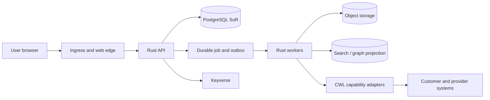

# ELUNVERA Threat Model

- **Document version:** 0.1
- **Status:** Proposed threat-model baseline
- **Date:** 2026-08-27

## 1. Scope

This threat model covers the proposed ELUNVERA web applications, Rust API and workers, PostgreSQL system of record, object storage, search and graph projections, Keyverse identity integration, CWL adapters, event transport, exports, and model workflows.

## 2. Protected assets

- tenant and workspace isolation;
- customer and stakeholder identities;
- relationship and account history;
- opportunity values, forecasts, strategy, and commitments;
- complaint narratives and remedies;
- contact points and communication preferences;
- model prompts, claims, evaluation evidence, and configuration;
- audit, legal hold, data-rights, and disposition records;
- integration credentials and provider mappings;
- release artifacts and database migrations.

## 3. Adversaries and failure actors

- unauthenticated internet attacker;
- compromised tenant user;
- malicious tenant administrator;
- overprivileged support operator;
- compromised service principal or connector;
- malicious or buggy provider webhook;
- hostile imported file or rich-text content;
- indirect prompt injection embedded in customer content;
- supply-chain attacker;
- accidental operator or migration error;
- noisy tenant causing resource exhaustion;
- insider attempting covert export or history alteration.

## 4. Trust boundaries

Every arrow crossing an organizational or runtime boundary requires authenticated identity, schema validation, bounded input, timeout, audit receipt, and explicit error handling.

## 5. Principal abuse cases

| ID | Threat | Security property | Required mitigation |
|---|---|---|---|
| TM-01 | Guess another tenant’s account ID | Confidentiality | tenant-bound authorization plus RLS; non-disclosing response |
| TM-02 | Modify a stale opportunity over a newer stage | Integrity | ETag, `If-Match`, temporal history, operation receipt |
| TM-03 | Replay a webhook or command | Integrity | signature, timestamp window, inbox deduplication, idempotency key |
| TM-04 | Inject SQL/Cypher/search syntax | Integrity and availability | typed queries, parameterization, allowlisted traversal, depth bounds |
| TM-05 | Upload executable or disguised content | Confidentiality and availability | signature-based MIME validation, quarantine, no execution or fetch |
| TM-06 | Prompt content asks model to leak data or call tools | Confidentiality | instruction/observation separation, bounded tools, policy evaluator |
| TM-07 | LLM invents stakeholder influence and system applies it | Integrity and fairness | separate model claim, evidence link, human review, no direct mutation |
| TM-08 | Support operator exports all tenant data | Confidentiality | purpose, maker-checker, time-bound role, export receipt, anomaly alert |
| TM-09 | Merge two parties incorrectly and erase history | Integrity | dry-run, evidence comparison, reversible mapping, immutable receipt |
| TM-10 | Delete data under legal hold | Compliance and integrity | hold check in DB and domain layer, fail closed, audit exception |
| TM-11 | Noisy tenant exhausts queue or DB pool | Availability | quotas, fair scheduling, pool partitioning, backpressure |
| TM-12 | Malicious migration removes isolation | Confidentiality | migration review, clean and upgrade rehearsal, policy tests |
| TM-13 | Dependency or CI action compromise | Integrity | exact pins, SBOM, provenance, signatures, minimal workflow permission |
| TM-14 | Graph projection gains authority over canonical data | Integrity | read-model-only credentials, rebuildability, command prohibition |
| TM-15 | Timing or error text reveals cross-tenant existence | Confidentiality | normalized not-found behavior, bounded timing, safe errors |
| TM-16 | Export formula executes in spreadsheet | Integrity | formula neutralization and format-specific security tests |
| TM-17 | Backup exists but keys or schema cannot restore it | Availability | scheduled restore rehearsal with key and migration verification |
| TM-18 | Provider outage causes duplicate external actions | Integrity | provider-sticky operation identity, command journal, reconciliation |

## 6. STRIDE summary

### Spoofing

Mitigated by Keyverse OIDC validation, phishing-resistant authentication profiles, service identity, short-lived credentials, and SCIM lifecycle.

### Tampering

Mitigated by optimistic concurrency, append-only history, source hashes, transactional outbox, signed artifacts, database constraints, and immutable audit.

### Repudiation

Mitigated by operation, export, review, merge, disposition, model, and provider receipts linked by correlation and causation identifiers.

### Information disclosure

Mitigated by tenant enforcement, purpose-aware field selection, disclosure policy, encryption, provider allowlists, and telemetry minimization.

### Denial of service

Mitigated by bounded input, query budgets, fair queues, asynchronous jobs, circuit breakers, rate limits, and capacity telemetry.

### Elevation of privilege

Mitigated by immutable verified context, no caller-supplied authority, least-privilege service accounts, maker-checker approval, and tool capability checks.

## 7. Model-specific threats

- indirect prompt injection;
- unsupported claims presented as facts;
- training-data or provider leakage;
- model drift and changed output contracts;
- biased relationship or opportunity predictions;
- confidence miscalibration;
- provider fallback changing data residency;
- unbounded recursive agent work;
- model output schema bypass;
- cached context crossing tenants.

All model paths use strict schema validation, evidence grounding, provider and region policy, bounded recursion, independent verification for consequential output, and tenant-bound caches.

## 8. Residual-risk governance

Every accepted residual risk records owner, rationale, scope, expiration, compensating control, monitoring signal, and re-review date. “Accepted” is not equivalent to “fixed” or “safe.” Expired acceptance fails the release or operation gate until reviewed.

## 9. Verification cadence

- threat model reviewed on every trust-boundary or high-impact data-flow change;
- dependency and provider threat review on every major version;
- tabletop exercise before GA and at least annually;
- external penetration test before processing production customer data;
- prompt-injection and tenant-isolation regression on every release candidate;
- backup, restore, and credential-rotation rehearsal on a scheduled cadence.
