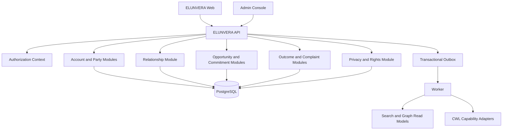
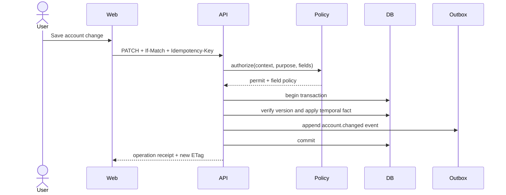
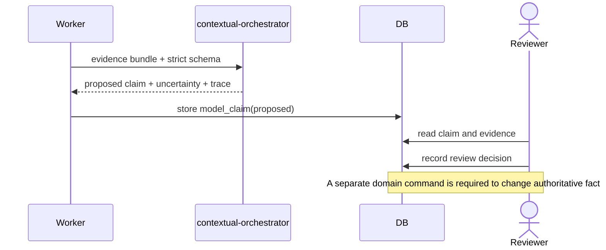
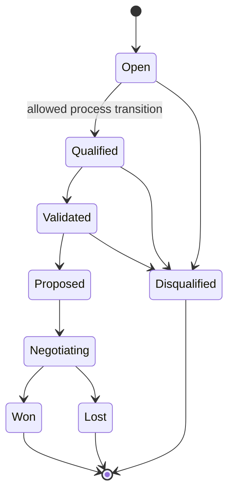
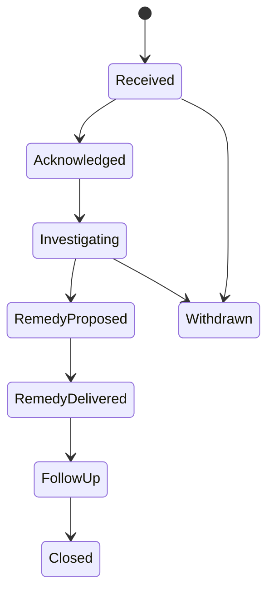
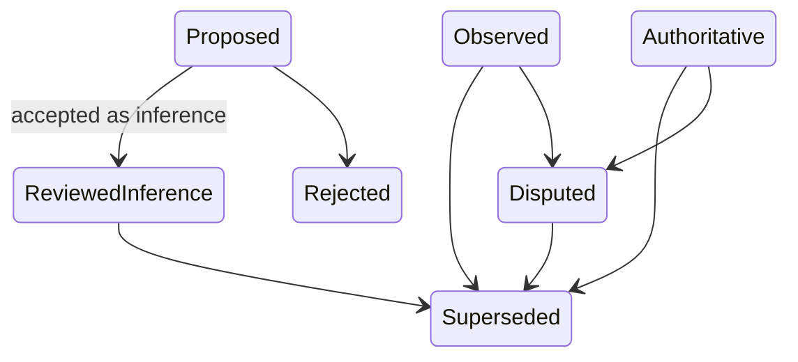

# ELUNVERA UML and Behavioral Models

## 1. Component model

## 2. Account aggregate sequence

## 3. Model-claim review sequence

## 4. Opportunity state model

The actual stages and allowed transitions are versioned per tenant. This diagram is an illustrative default, not a hard-coded sales methodology.

## 5. Complaint state model

## 6. Truth-status state model

No state transition automatically converts an inference into an authoritative source fact.
